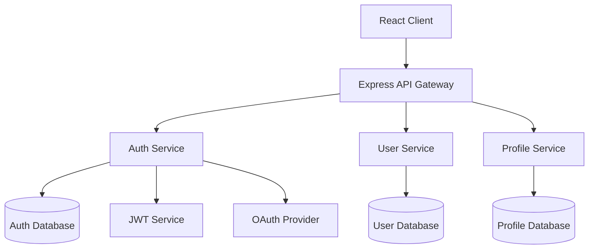

# Phases: 3 段階の対話ワークフロー詳細

Kiro 式 spec-driven development の Phase 1 (Requirements) / Phase 2 (Design) / Phase 3 (Implementation Planning) の詳細対話プロセス。SKILL.md 本体から「各 Phase の対話を進めるとき」「EARS 記法 / Mermaid / TypeScript の出力サンプルが必要なとき」に参照する。

## Contents
- [Phase 1: Requirements Discovery & Discussion](#phase-1-requirements-discovery--discussion)
- [Phase 2: Design Exploration & Discussion](#phase-2-design-exploration--discussion)
- [Phase 3: Implementation Planning & Discussion](#phase-3-implementation-planning--discussion)
- [EARS 記法リファレンス](#ears-記法リファレンス)
- [実行例 (段階的フロー)](#実行例-段階的フロー)

---

## Phase 1: Requirements Discovery & Discussion

### 1. 最小限入力からの自動拡張 (Kiro 式)

```
ユーザー: 「ユーザー管理システム
- ログイン機能
- プロフィール編集
- 管理者権限」

Claude: 「要件から詳細なユーザーストーリーを生成します。
この理解で正しいですか?

自動生成されたユーザーストーリー:
- ユーザー登録・認証機能 (OAuth 対応)
- プロフィール管理機能 (アバター、設定)
- 権限管理機能 (RBAC)
- パスワードリセット機能
- セキュリティ監査ログ

明示されていない詳細を補完しました。他に必要な機能はありますか?」
```

### 2. EARS 記法による構造化要件記述

```
Claude: 「Kiro の EARS 記法で要件を構造化します:

EARS 記法による要件定義:

WHEN ユーザーがログインを試行する際
GIVEN 正しいメールアドレスとパスワードを入力した場合
THEN システムは認証を確認する
AND 成功時はダッシュボードにリダイレクトする

WHILE ユーザーがプロフィール編集画面にいる間
THE SYSTEM SHALL リアルタイムでバリデーションを実行する
AND 変更内容をプレビュー表示する

WHERE 管理者権限が必要な機能に
IS アクセスが試行された場合
THE SYSTEM SHALL 権限レベルを確認する
AND 不十分な場合はアクセス拒否する」
```

### 3. エッジケース・セキュリティ要件の自動補完

```
Claude: 「Kiro のベストプラクティスに基づき、以下のケースも考慮しました:

セキュリティ要件 (自動補完):
- ブルートフォース攻撃対策
- セッション管理とタイムアウト
- CSRF 保護と XSS 対策
- パスワード強度要件

エッジケース (自動検出):
- 同時ログイン制限
- アカウントロック機能
- データ移行時の整合性確保
- 大量リクエスト時の負荷分散

これらの要件は適切ですか?」
```

### 4. Phase 1 完了と承認

```
Claude: 「Requirements Phase が完了しました。
requirements.md を生成してよろしいですか?」
→ 「次に進んで」→ requirements.md 生成
```

---

## Phase 2: Design Exploration & Discussion

### 1. コードベース分析 + 自動設計提案

```
Claude: 「既存コードベースを分析し、最適なアーキテクチャを提案します:

コードベース分析結果:
- 認証: JWT + Express.js (v4.18.x)
- データベース: PostgreSQL (v14+)
- フロントエンド: React + TypeScript (v18+)
- 既存パターン: Repository パターン、Service 層分離

Kiro 推奨アーキテクチャ:
- Clean Architecture 準拠
- Domain-Driven Design 要素
- CQRS パターンの部分的適用
- 自動化されたセキュリティベストプラクティス

この設計で進めますか?」
```

### 2. Mermaid 図による視覚的設計



### 3. TypeScript インターフェース自動生成

```typescript
// Domain entities
interface User {
  readonly id: UserId;
  readonly email: Email;
  readonly profile: UserProfile;
  readonly auth: AuthSettings;
  readonly permissions: Permission[];
  readonly createdAt: Date;
  readonly updatedAt: Date;
}

interface UserProfile {
  readonly displayName: string;
  readonly avatar: AvatarUrl;
  readonly preferences: UserPreferences;
}

interface AuthSettings {
  readonly passwordHash: PasswordHash;
  readonly mfaEnabled: boolean;
  readonly lastLoginAt: Date;
  readonly failedAttempts: number;
}

// Use cases
interface UserRepository {
  findById(id: UserId): Promise<User | null>;
  findByEmail(email: Email): Promise<User | null>;
  save(user: User): Promise<void>;
}

interface AuthenticationService {
  authenticate(credentials: LoginCredentials): Promise<AuthResult>;
  refreshToken(token: RefreshToken): Promise<AccessToken>;
}
```

### 4. Phase 2 完了と承認

```
Claude: 「Design Phase が完了しました。
design.md を生成してよろしいですか?」
→ 「次に進んで」→ design.md 生成
```

---

## Phase 3: Implementation Planning & Discussion

### 1. ベストプラクティス自動適用

```
Claude: 「Kiro のベストプラクティスを自動適用した実装計画を生成しました:

自動生成された実装戦略:

1. セキュリティファースト開発
   - OWASP Top 10 対策の自動組み込み
   - 暗号化・ハッシュ化の自動実装
   - セキュリティテストの自動生成

2. クリーンアーキテクチャの強制
   - レイヤー分離の自動実装
   - 依存性逆転の自動適用
   - テスタブルな設計の強制

3. パフォーマンス最適化
   - キャッシュ戦略の自動実装
   - データベース最適化
   - 非同期処理の活用

このアプローチで進めますか?」
```

### 2. 品質チェックポイント自動設定

```
自動品質保証プロセス:

Phase 3a: バックエンド実装
- [ ] セキュリティスキャン (SAST/DAST)
- [ ] API 仕様テスト (OpenAPI 準拠)
- [ ] パフォーマンステスト (負荷・レスポンス)
- [ ] 脆弱性スキャン (依存関係・CVE)

Phase 3b: フロントエンド実装
- [ ] アクセシビリティテスト (WCAG 2.1 AA)
- [ ] ブラウザ互換性テスト
- [ ] レスポンシブデザイン検証
- [ ] セキュリティヘッダー確認

Phase 3c: 統合・デプロイ
- [ ] E2E テストスイート
- [ ] CI/CD パイプライン設定
- [ ] モニタリング・ログ設定
- [ ] 本番環境セキュリティ監査
```

### 3. 依存関係とリスク軽減の自動分析

```
最適化された実装順序:

Week 1: インフラ・セキュリティ基盤
- データベース設計・スキーマ作成
- 認証基盤 (JWT + セッション管理)
- セキュリティミドルウェア実装
- 基本的な API エンドポイント

Week 2: コア機能実装
- ユーザー管理機能
- プロフィール管理機能
- 権限管理システム
- バリデーション・エラーハンドリング

Week 3: 高度な機能・最適化
- 多要素認証実装
- 監査ログ機能
- パフォーマンス最適化
- フロントエンド統合

自動検出されたリスク軽減策:
- 多要素認証: 段階的導入 (SMS → アプリ認証)
- セッション管理: Redis クラスター構成
- 大量アクセス: レート制限 + CDN 活用
- データ整合性: トランザクション管理強化
```

### 4. Phase 3 完了と承認

```
Claude: 「Implementation Planning Phase が完了しました。
tasks.md を生成してよろしいですか?」
→ 「次に進んで」→ tasks.md 生成
```

---

## EARS 記法リファレンス

EARS = Easy Approach to Requirements Syntax。

```markdown
WHEN [状況・トリガー]
GIVEN [前提条件]
THEN [システムの動作]
AND [追加の動作]

WHILE [状態・プロセス]
THE SYSTEM SHALL [必須動作]
AND [関連動作]

WHERE [機能・コンポーネント]
IS [条件・状態]
THE SYSTEM SHALL [対応動作]
```

---

## 実行例 (段階的フロー)

```bash
ユーザー: 「ユーザー管理システムの spec を作成して」

# Phase 1: Requirements Discovery
Claude: [要件の確認と議論開始]
ユーザー: [応答・議論・修正]
Claude: 「Requirements Phase が完了しました。次に進んでよろしいですか?」
ユーザー: 「次に進んで」
→ requirements.md 生成

# Phase 2: Design Exploration
Claude: [設計の提案と議論開始]
ユーザー: [技術選択・アーキテクチャ議論]
Claude: 「Design Phase が完了しました。次に進んでよろしいですか?」
ユーザー: 「次に進んで」
→ design.md 生成

# Phase 3: Implementation Planning
Claude: [実装計画の議論開始]
ユーザー: [優先度・リスク・工数の議論]
Claude: 「Implementation Phase が完了しました。次に進んでよろしいですか?」
ユーザー: 「次に進んで」
→ tasks.md 生成

# 完了
Claude: 「spec 駆動開発の準備が完了しました。実装を開始できます。」
```
